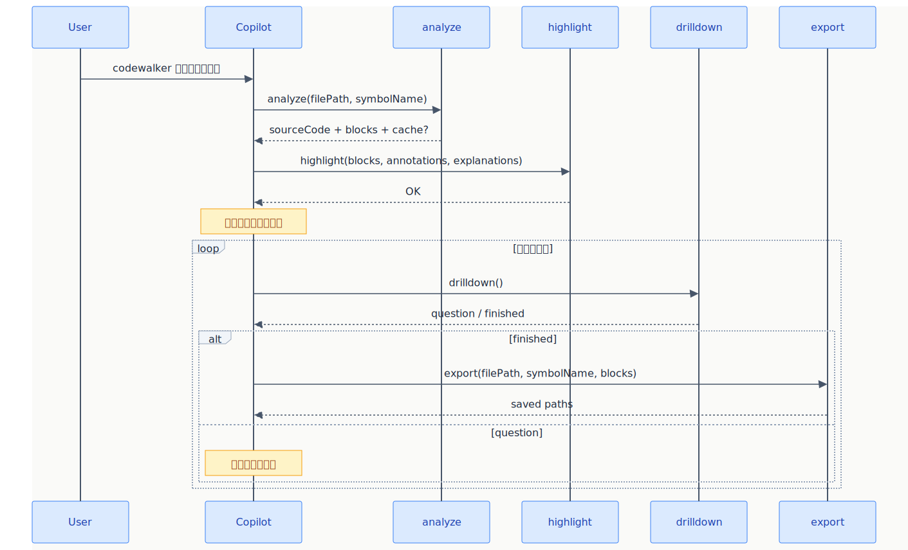
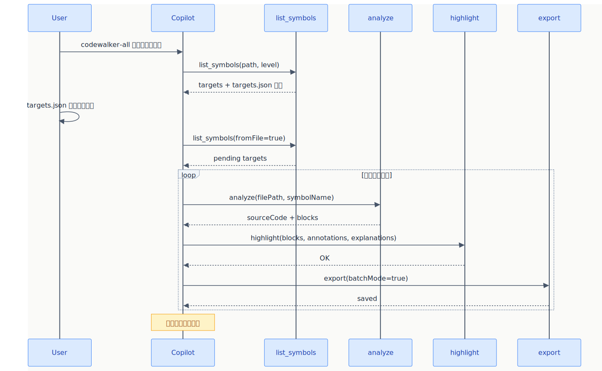
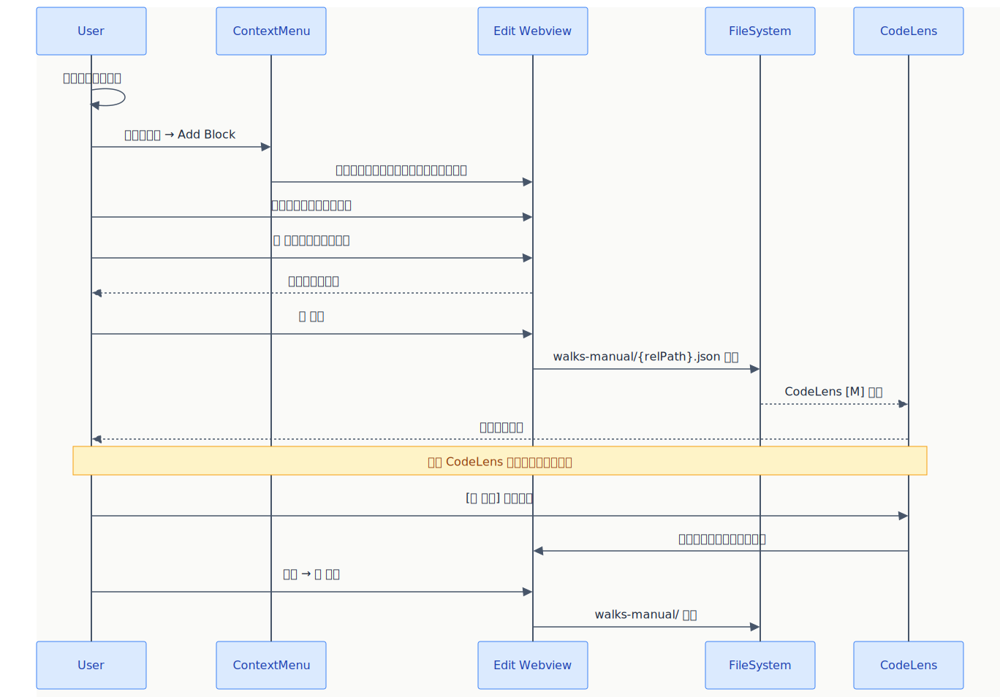
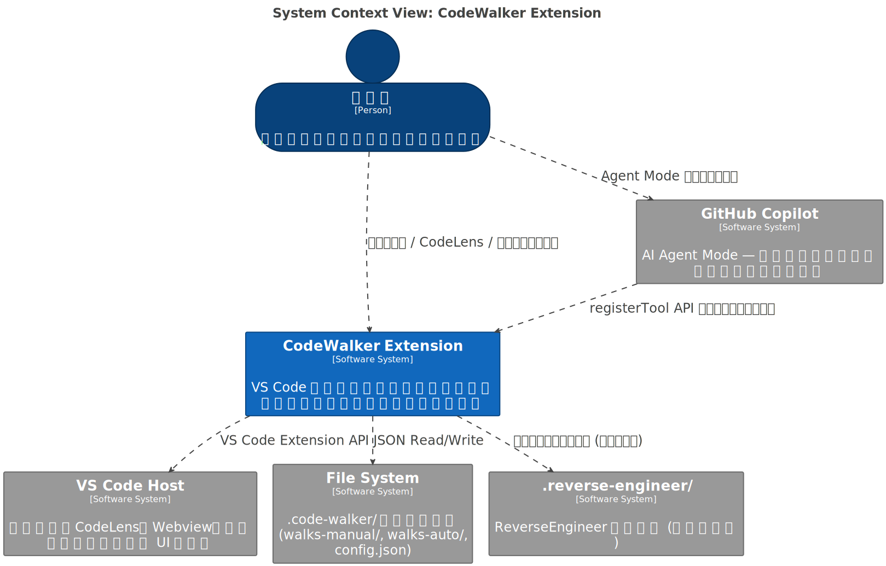
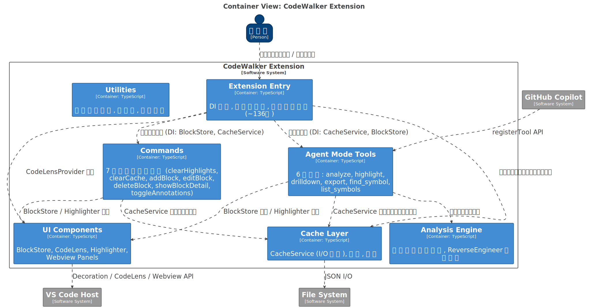
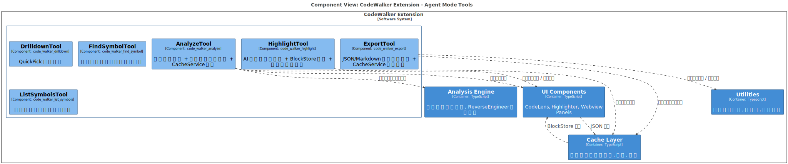

# 01 — 概要・アーキテクチャ

[← 目次](./README.md)

> 最終更新: 2026-04-28

---

## 設計原則

| 原則 | 説明 |
|---|---|
| 一括生成 | ブロック解説は逐次選択ではなく一度にすべて生成 |
| 色分け保持 | analyze の 6 色パレットは後続ツールで上書きしない |
| シンボル単位管理 | CodeLens・ハイライト・キャッシュはシンボル単位で独立 |
| Auto / Manual 分離 | AI 生成とユーザー手動定義を別ストアで管理 |
| Agent Mode 統合 | `lm.registerTool` API で Copilot が自律的にツール呼出 |

---

## アーキテクチャ図

> `bash scripts/render-diagrams.sh` で SVG 生成



---

## ファイル構成

| 対象 | 規模 | 責務 |
|---|---:|---|
| `src/extension.ts` | 506 行 | エントリポイント。DI 配線、views / commands / tools 登録、復元ライフサイクル管理 |
| `src/commands/` | 10 ファイル | コマンドパレット / CodeLens 起点の操作。repair / compare / graph / timeline を含む |
| `src/tools/` | 6 ファイル | Agent Mode から呼ばれる `code_walker_*` ツール群 |
| `src/sidebar/` | 5 ファイル | Sidebar snapshot 生成、TreeDataProvider、context menu 動作、階層整形 |
| `src/walker/` | 7 ファイル | BlockStore、CodeLens、ハイライト、Detail/Edit Webview、シンボル検索 |
| `src/cache/` | 4 ファイル | キャッシュ型、I/O、復元、設定読み込み |
| `src/analysis/` | 2 ファイル | analyze 結果の組み立てと `.reverse-engineer/` 読み込み |
| `src/utils/` | 複数ユーティリティ | ファイル操作、通知、Markdown 生成、ロギング |
| `media/` | 6 アセット | Webview の CSS / JavaScript |
| ルート | `esbuild.config.mjs` | バンドル設定とパスエイリアス |
| 主要実装合計 | 約 8,200 行 | テスト・ドキュメントを除く TypeScript / Webview 資産の目安 |

---

## 登録物一覧

### ツール

| ツール | 説明 |
|---|---|
| `code_walker_analyze` | 構造解析 + 色分け + CodeLens 登録 |
| `code_walker_highlight` | 行末注釈 + ブロック解説保存 |
| `code_walker_drilldown` | QuickPick 質問入力 / ESC 終了 |
| `code_walker_export` | JSON / Markdown エクスポート |
| `code_walker_find_symbol` | ワークスペース横断シンボル検索 |
| `code_walker_list_symbols` | フォルダ再帰シンボル列挙 + targets.json |

### コマンド

| コマンド | 説明 |
|---|---|
| `codeWalker.clearHighlights` | 全ハイライト・CodeLens・パネルをクリア |
| `codeWalker.clearCache` | キャッシュクリア（ファイル / シンボル / 全体） |
| `codeWalker.showBlockDetail` | CodeLens → Webview パネル表示 |
| `codeWalker.toggleAnnotations` | 行末注釈 ON/OFF |
| `codeWalker.addBlock` | 選択範囲をマニュアルブロックとして追加 |
| `codeWalker.editBlock` | ブロック編集 Webview を開く（CodeLens 経由） |
| `codeWalker.deleteBlock` | ブロック削除（確認ダイアログ付き、CodeLens 経由） |
| `codeWalker.repairWalkthrough` | active editor 上の stale block を修復 |
| `codeWalker.setViewMode` | 表示モード切替（Both / Manual Only / Auto Only） |
| `codeWalker.compareWalkthroughs` | 現在の `.code-walker` と任意フォルダを比較 |
| `codeWalker.openSymbolGraph` | walkthrough / targets / import / reference をグラフ表示 |
| `codeWalker.openTimeline` | current cache と snapshot root を時系列表示 |

### Sidebar コマンド

| コマンド | 説明 |
|---|---|
| `codeWalker.sidebar.refresh` | Sidebar の snapshot を再読込 |
| `codeWalker.sidebar.openNode` | file / block / target ノードを開く |
| `codeWalker.sidebar.showNodeDetail` | walkthrough block の詳細パネルを開く |
| `codeWalker.sidebar.openTargetsFile` | `.code-walker/targets.json` を開く |
| `codeWalker.sidebar.exportNode` | symbol / block ノードを Markdown 出力 |
| `codeWalker.sidebar.clearNodeCache` | file / symbol ノードの cache を削除 |
| `codeWalker.sidebar.repairNode` | stale file / symbol / block を修復 |

### Sidebar Views

| View | 説明 |
|---|---|
| `Walkthrough Explorer` | File → Symbol → Block の登録済み walkthrough 一覧 |
| `Uncovered Files` | walkthrough キャッシュ未作成の対象ファイル一覧 |
| `Stale Queue` | `blockHash` 不一致の stale block を含むシンボル一覧 |
| `Batch Targets` | `targets.json` の pending / done / skip 一覧 |

---

## フロー

### 対話モード（codewalker）



| Step | ツール | 内容 |
|---|---|---|
| 1 | analyze | シンボル解析 + 色分け |
| 2 | highlight | 注釈 + 全ブロック解説 |
| 3 | drilldown | 質問入力ループ |
| 4 | _(チャット)_ | 質問回答 → Step 3 |
| 5 | export | 結果保存 |

### バッチモード（codewalker-all）



| Step | ツール | 内容 |
|---|---|---|
| 1 | list_symbols | ターゲット一覧 → targets.json |
| 2 | _(ループ)_ | analyze → highlight → export(batchMode) |
| 3 | _(チャット)_ | 完了サマリー |

### マニュアルモード



| Step | 操作 | 内容 |
|---|---|---|
| 1 | 範囲選択 → 右クリック | 「Add Block」コンテキストメニュー |
| 2 | 編集 Webview | ラベル・解説・色を入力 |
| 3 | 保存 | walks-manual/ にキャッシュ保存 |
| 4 | CodeLens 表示 | [M] バッジ付きブロック表示 |

---

## プロンプトファイル

```
.github/prompts/
├── codewalker.prompt.md       # 対話型
└── codewalker-all.prompt.md   # バッチ処理
```

対象プロジェクトに配置。サンプルは `sample_project/` にあり。

---

## デザインパターン

| パターン | 適用箇所 | 説明 |
|---|---|---|
| **Dependency Injection** | `extension.ts` → 全ツール / コマンド / CodeLensProvider | `activate()` で BlockStore・CacheService を生成しコンストラクタ注入。循環参照を排除 |
| **Singleton (Module)** | BlockStore, CacheService (`extension.ts` で生成), `highlighter.ts` のモジュール変数, `state.ts` | `activate()` で 1 回だけ生成し全コンシューマに注入 |
| **Observer / Event** | `BlockStore.onDidChange` → `CodeLensProvider` | BlockStore のデータ変更を CodeLensProvider が購読し CodeLens を自動更新 |
| **Command Pattern** | `src/commands/` (10 ファイル) | 各コマンドハンドラを独立した関数として分離。extension.ts は登録のみ |
| **Strategy (Interface)** | 6 ツールが `vscode.LanguageModelTool<T>` を実装 | 共通インターフェースで各ツールの `invoke()` を差し替え可能 |
| **Registry** | `vscode.lm.registerTool()` で 6 ツールを名前付き登録 | AI Agent が名前でツールを発見・呼び出す |
| **Facade** | `extension.ts` の `activate()` | DI 配線・ツール登録・コマンド登録・ライフサイクル管理を一箇所に集約 |
| **Service (Stateless)** | `CacheService` | ステートレスなキャッシュ I/O サービス。ワークスペースパスのみ保持 |
| **Template (HTML)** | `blockDetailPanel.ts`, `blockEditPanel.ts` | Webview HTML を TypeScript テンプレートリテラルで生成。CSS/JS は `media/` に外部化 (L2) |
| **Accumulator** | `highlighter.ts` の `storedBlocks`, `storedAnnotations` | 複数シンボルのハイライトを蓄積・マージして表示 |

---

## C4 モデル

Structurizr DSL ソース: `docs/design/docs/resources/diagram/c4-*.dsl`

### Level 1: System Context



### Level 2: Container



### Level 3: Component (Tools)



> L3 Component 図は `tools` コンテナ視点。他コンテナは外部依存として表示される。
> `c4-component.dsl` には `ComponentUI` ビューも定義済み。
