# 03 — UI コンポーネント設計

[← 目次](./README.md)

> 最終更新: 2026-04-28

---

## カラーパレット

| # | 色 | 背景 (10%) | ボーダー (40%) |
|---|---|---|---|
| 0 | 青 | `rgba(66,133,244, 0.10)` | `rgba(66,133,244, 0.40)` |
| 1 | 緑 | `rgba(52,168,83, 0.10)` | `rgba(52,168,83, 0.40)` |
| 2 | 紫 | `rgba(154,77,202, 0.10)` | `rgba(154,77,202, 0.40)` |
| 3 | 橙 | `rgba(234,134,0, 0.10)` | `rgba(234,134,0, 0.40)` |
| 4 | 赤 | `rgba(219,68,55, 0.10)` | `rgba(219,68,55, 0.40)` |
| 5 | シアン | `rgba(0,172,193, 0.10)` | `rgba(0,172,193, 0.40)` |

- 6 ブロック超はパレット循環
- Manual モードではユーザーが色を選択可能

---

## CodeLens

### 表示フォーマット

```
① 初期化処理 — 設定読込とログ設定 [M]    ← クリック可能
config = load_config(Path("config.yaml"))
```

### バッジ

| バッジ | 意味 |
|---|---|
| `[M]` | Manual（ユーザー手動定義） |
| `[A]` | Auto（AI 自動生成） |
| `⚠` | ブロック不整合（ブロックハッシュ不一致 / 保存時検証で異常検出） |

### ボタン

| ボタン | 動作 | 対象 |
|---|---|---|
| ラベルクリック | Webview パネルに解説表示 | 全ブロック |
| `[🛠]` | stale block を修復。安全に自動修復できない場合は edit / import へフォールバック | stale block |
| `[📝]` | 編集 Webview を開く | Manual ブロックのみ |
| `[✕]` | ブロック削除（確認ダイアログ） | Manual ブロックのみ |
| `[📥]` | Auto → Manual インポート（編集 Webview） | Auto ブロックのみ |

- stale 時はタイトル側に `⚠` が付き、`[🛠]` が追加される
- 修復はまず定義行シフトを試し、だめなら symbol 内の `blockHash` 一意一致で block 単位再配置を試す

---

## Sidebar（Activity Bar）

Activity Bar の `CodeWalker` コンテナに 4 つの view を常設する。



| View | 目的 |
|---|---|
| `Walkthrough Explorer` | File → Symbol → Block の walkthrough を辿る |
| `Uncovered Files` | walkthrough が未作成の対象ファイルを列挙する |
| `Stale Queue` | `blockHash` 不一致の stale block を含むシンボルだけを抽出する |
| `Batch Targets` | `.code-walker/targets.json` の pending / done / skip を確認する |

### Sidebar ノード操作

| 操作 | 動作 |
|---|---|
| open | file / block / target をエディタで開く |
| show detail | walkthrough block の Detail Webview を開く |
| export | symbol / block ノードを Markdown に出力する |
| repair | stale file / symbol / block を修復する |
| clear cache | file / symbol 単位で cache を削除する |

- file と target はフォルダ階層を挟んで表示できる
- `Registered`, `Manual`, `Auto`, `Mixed`, `stale` 件数を description に持つ

---

## Webview パネル（閲覧）

- ブロック色ボーダー + 丸数字ラベル
- ソースコード（シンタックスハイライト 7 言語対応、`<details>` で折りたたみ可能）
- 解説（Markdown → HTML: コードフェンス、引用、リンク、水平線、画像リンク、生 URL 自動リンク化）
- VS Code テーマ変数連動
- パネルは 1 つ（再利用・上書き）

### ナビゲーションバー

同一シンボル内に複数ブロックがある場合、パネル上部にナビバーを表示。

| UI 要素 | 動作 |
|---|---|
| `◀ 前` / `次 ▶` ボタン | 前後ブロックへジャンプ |
| `<select>` ドロップダウン | 全ブロック一覧から選択 |
| ファイルパスリンク | 解説文中のファイル参照をクリックでエディタで開く |

ナビゲーション操作は Webview → Extension への `postMessage` で実現。

### 対応言語

Python / TypeScript / JavaScript / Java / Go / Rust / C#

---

## Webview パネル（編集）

マニュアルモード用。右クリック「Add Block」または CodeLens `[📝]` で表示。

| フィールド | 入力方式 | 説明 |
|---|---|---|
| ラベル | テキスト | ブロック名（例: 初期化処理） |
| 行範囲 | 数値 × 2 | startLine – endLine |
| 概要 | テキスト | 1 行概要 |
| 色 | 6 色セレクタ | パレットから選択 |
| 解説 | テキストエリア | Markdown 記法 |
| アノテーション | 行: テキスト × N | 行末注釈リスト |

### ボタン

| ボタン | 動作 |
|---|---|
| 👁 プレビュー | エディタ上にハイライト仮表示 |
| 💾 保存 | walks-manual/ へ保存 + CodeLens 更新 |

---

## Repair Preview パネル

stale repair で安全な自動適用はできないが候補を提示できる場合に開く。現行実装では、同一 `blockHash` が current symbol 内の複数箇所に一致したケースを preview し、ユーザーが候補を選んで適用できる。

| 領域 | 内容 |
|---|---|
| Current Symbol | 現在のシンボルコード、旧範囲、選択候補範囲をハイライト |
| Repair Candidates | strategy、候補行範囲、理由、explanation / annotations 保持可否を表示 |
| Actions | Apply Selected Candidate / Open Selected Candidate / Continue in Edit/Import |

- `canApply=true` の候補だけを直接適用できる
- 適用時は元の保存先（Manual / Auto）に書き戻し、restore 経由で再描画する
- preview を閉じたり edit/import に進むだけでは cache を更新しない

---

## 行末アノテーション

```python
config = load_config(Path("config.yaml"))    ← 設定ファイル読込
```

- イタリック、薄い色（スタイルは設定 `codeWalker.annotationStyle` で変更可）
- 蓄積型マージ（同行は上書き）
- `Toggle Annotations` コマンドで ON/OFF

---

## 表示モード (ViewMode)

`codeWalker.setViewMode` コマンドまたはステータスバーから切替。

| モード | CodeLens | ハイライト | ステータスバー |
|---|---|---|---|
| Both | Manual + Auto 両方表示 | 全ブロック | `CW: $(layers) Both` |
| Manual Only | Manual のみ | Manual のみ | `CW: $(edit) Manual` |
| Auto Only | Auto のみ | Auto のみ | `CW: $(robot) Auto` |

- 切替時に CodeLens とエディタ装飾の両方が即座に再描画される
- 起動時のデフォルトは設定 `codeWalker.viewMode` で変更可（デフォルト: `both`）

---

## 比較パネル (Compare Walkthroughs)

`codeWalker.compareWalkthroughs` コマンドで起動。ユーザー管理のバックアップフォルダとの差分比較を実行し、Webview で結果を表示する。

### フロー

1. **対象 A 選択** — QuickPick で「現在のキャッシュ」またはフォルダ選択
2. **対象 B 選択** — フォルダ選択ダイアログ（必須）
3. **比較実行** — 両フォルダの `walks-manual/` + `walks-auto/` を再帰読込
4. **結果表示** — ファイル → シンボル → ブロック の 3 階層差分を Webview に表示

### 差分表示

| アイコン | 意味 |
|---|---|
| 🟢 | 追加（B にのみ存在） |
| 🔴 | 削除（A にのみ存在） |
| 🟡 | 変更（両方に存在、内容が異なる） |

変更ブロックはラベル・行範囲・色・概要・解説の差異を個別表示する。

### バックアップ運用例

```
.code-walker/                       ← 対象 A (現在の最新)
  walks-manual/
  walks-auto/
.code-walker/backup_20260227/       ← 対象 B (バックアップ)
  walks-manual/
  walks-auto/
```

ユーザーが任意のタイミングで `.code-walker/` をコピーしてバックアップフォルダを作成し、比較コマンドで差分を確認する運用を想定。

---

## Graph / Timeline

### Symbol Graph

`CodeWalker: Open Symbol Graph` で Webview を開き、walkthrough / targets / import / reference を同一キャンバスで可視化する。

| 要素 | 内容 |
|---|---|
| ノード | file / symbol / block |
| エッジ | contains / imports / references |
| フィルタ | search / folder prefix / stale / manual |
| 詳細 | walkthrough metadata をサイドパネル表示 |

### Timeline

`CodeWalker: Open Timeline` で current `.code-walker` と任意 snapshot root を時系列に並べる。

| 要素 | 内容 |
|---|---|
| ポイント | snapshot ごとの `source`, `blockCount`, `stale`, `updatedAt`, `changeMagnitude` |
| 比較導線 | 任意の 2 点から既存 compare パネルを開く |
| フィルタ | symbol / filePath 単位 |
