# 04 — キャッシュ・エクスポート設計

[← 目次](./README.md)

> 最終更新: 2026-04-28

---

## フォルダ構造

```
.code-walker/
├── targets.json               # バッチ処理ターゲットリスト
├── walks-manual/              # 手動定義
│   └── src/
│       └── models/
│           └── user.py.json
└── walks-auto/                # AI 自動生成
    ├── main.py.json
    └── src/
        └── models/
            └── user.py.json
```

- ソースディレクトリ構造をそのままミラー
- パス区切りの衝突なし

---

## JSON スキーマ

```jsonc
{
  "version": "1.0",
  "filePath": "src/models/user.py",
  "symbols": {
    "validate_user": {
      "symbolName": "validate_user",
      "overview": "ユーザー入力を検証する",
      "updatedAt": "2026-02-25T12:00:00Z",
      "source": "manual",            // "manual" | "auto"
      "blocks": [
        {
          "label": "入力チェック",
          "startLine": 10,
          "endLine": 25,
          "colorIndex": 0,           // Manual: ユーザー指定
          "description": "必須フィールドの検証",
          "blockHash": "sha256:def456...",  // ブロック対象行のハッシュ
          "explanation": "...",
          "annotations": [
            { "line": 12, "text": "メールアドレス形式チェック" }
          ]
        }
      ]
    }
  }
}
```

### walks-manual と walks-auto の差分

| フィールド | walks-auto | walks-manual |
|---|---|---|
| `source` | `"auto"` | `"manual"` |
| `colorIndex` | 自動割当（0-5 循環） | ユーザー選択 |
| `blockHash` | ブロック対象行の SHA-256 | ブロック対象行の SHA-256 |

---

## キャッシュ解決フロー



```
シンボル表示要求
  │
  ├─ walks-manual/{relPath}.json に該当シンボルあり？
  │   └─ YES → Manual データを表示候補に追加 [M]
  │
  ├─ walks-auto/{relPath}.json に該当シンボルあり？
  │   └─ YES → Auto データを表示候補に追加 [A]
  │
  └─ ViewMode で Manual / Auto / Both をフィルタ
```

**同一シンボルでも共存可能**: Both では Manual と Auto の CodeLens / highlight が同時に表示される。Manual Only / Auto Only では source ごとにフィルタする。

図は現行の restore / stale 判定 / repair 入口までを含む。

---

## ブロックハッシュ検知

> Phase 9 で `fileHash`（ファイル全体）から `blockHash`（ブロック対象行）に移行済み。
> ブロックと無関係な編集で ⚠ が出なくなり、変更されたブロックだけに ⚠ が付く。

| タイミング | 動作 |
|---|---|
| export 時 | ブロック対象行（startLine〜endLine）の SHA-256 を `blockHash` に保存 |
| restoreCache 時 | 現在のブロック内容のハッシュと比較 |
| 不一致時 | CodeLens に `⚠` マーク表示 |
| 保存時 (C2-F) | `validateBlocks` で0行/逆転/重複ブロックを検出し `⚠` 付与 |

復元自体は行う（ズレていても見えた方が有用）。

---

## stale repair と cache 更新

stale block は `restoreCache` の `blockHash` 検証で検出し、CodeLens と Sidebar の両方から修復できる。

| ステップ | 動作 |
|---|---|
| 1 | `restoreCache` が `blockHash` 不一致を検出し、`hashMismatch` を BlockStore に反映 |
| 2 | `Repair Walkthrough` がまず「シンボル定義行の差分による一括シフト」を試す |
| 3 | それで成立しない場合、current symbol 内で target block の `blockHash` が一意一致する範囲を探索する |
| 4 | 一致が 1 件だけなら explanation / annotations / source を保持したまま cache の行範囲を更新 |
| 5 | 複数候補など曖昧だが提示可能な場合は Repair Preview を開く |
| 6 | 候補も作れない場合だけ edit / import パネルへフォールバック |

- 自動修復時は `updatedAt` を更新する
- Auto / Manual の優先順位は変えず、元の保存先に書き戻す
- blockHash が複数箇所で一致した場合は曖昧とみなし自動適用せず、Repair Preview で候補選択に回す

---

## Clear Cache コマンド

`codeWalker.clearCache` — QuickPick で対象選択:

| 選択肢 | 動作 |
|---|---|
| 現在のファイル | 該当ファイルの Manual / Auto 両方削除 |
| 現在のシンボル | 該当シンボルのエントリのみ削除 |
| プロジェクト全体 (Auto) | walks-auto/ を全削除 |
| プロジェクト全体 (Manual) | walks-manual/ を全削除（確認ダイアログ） |
| プロジェクト全体 (両方) | walks-auto/ + walks-manual/ 全削除 |

Sidebar からは file / symbol ノード単位で同じ削除を直接実行できる。

---

## エクスポート保存フロー

```
exportTool.invoke()
  │
  ├─ 保存先ディレクトリ作成（ミラー構造）
  ├─ 既存 JSON 読込 (read-modify-write)
  ├─ symbols[symbolName] を追加/更新
  ├─ blockHash を計算・保存（ブロック対象行の SHA-256）
  └─ JSON 書込
```

- Auto: `walks-auto/{relPath}.json`
- Manual: `walks-manual/{relPath}.json`
- Markdown: `walks-{mode}/{relPath}/{symbolName}.md`


